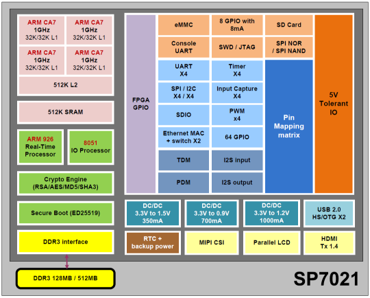
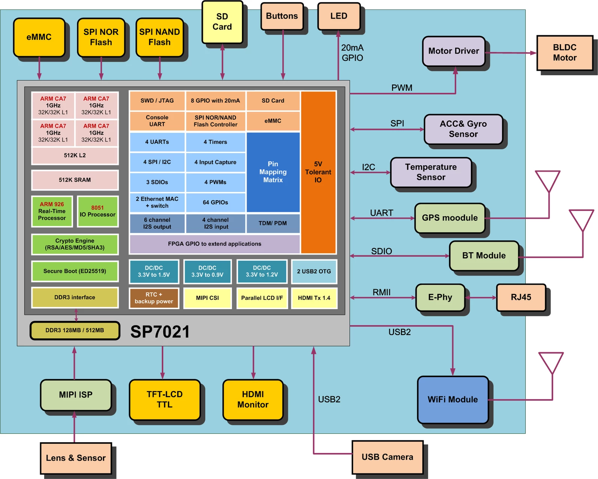

# [SP7021](https://github.com/SoCXin/SP7021)

* [Sunplus](https://w3.sunplus.com): [Cortex-A7](https://github.com/SoCXin/Cortex)
* [L6R5](https://github.com/SoCXin/Level): 960 MHz

## [简介](https://github.com/SoCXin/SP7021/wiki)

### 关键特性

* Cortex-A7 960 MHz
* ARM926EJS 202 MHz
* 8051 Core Selectable 32KHz or 202MHz operating speed
* Two IEEE 802.3 10/100M ports with RMII interface
* HDMI TX 1.4, resolution up to 720P

### [资源收录](https://github.com/SoCXin)

* [参考资源](src/)
* [参考文档](docs/)
* [参考工程](project/)
* [入门教程](https://docs.soc.xin/SP7021)

### [选型建议](https://github.com/SoCXin)

[SP7021](https://github.com/SoCXin/SP7021)集成度非常高

* [BPI-F2S](https://github.com/BPI-SINOVOIP/BPI-F2S-bsp)

https://wiki.banana-pi.org/Banana_Pi_BPI-F2S

#### 封装规格

* SP7021-IS : built-in 128MB DDR3
* SP7021-IF : built-in 512MB DDR3

### [探索芯世界 www.SoC.xin](http://www.SoC.Xin)
